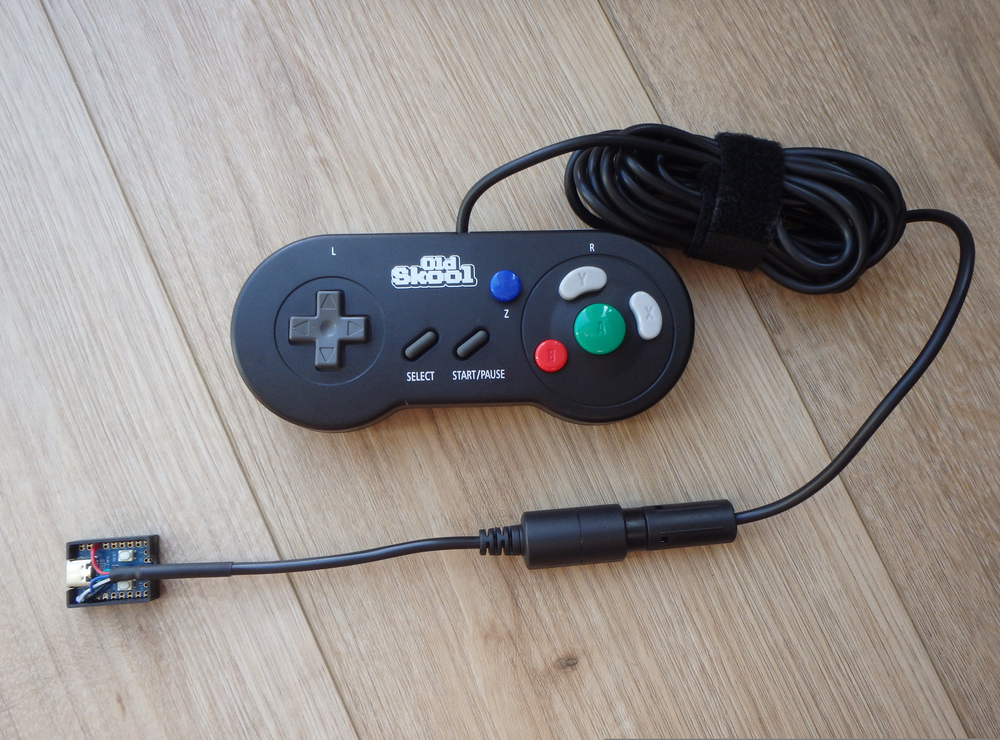
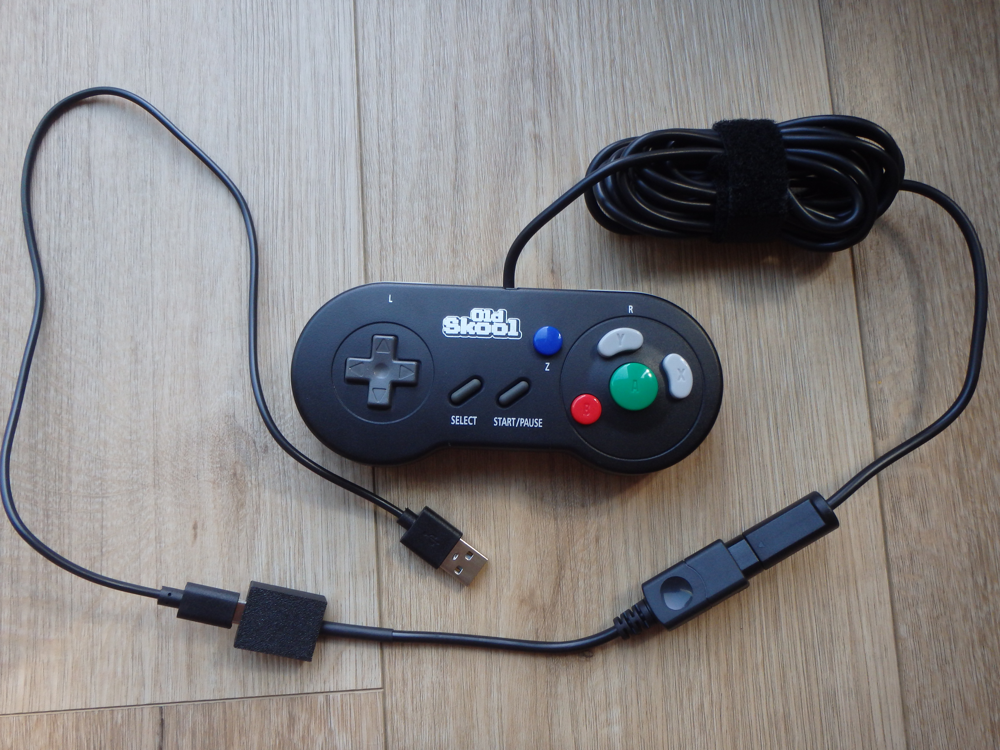

# OldSkool Digital GC2Pocket — Old Skool digital GameCube controller → Analogue Pocket (PS4 mode, Z = Select)

Custom build of the open-source **joypad-os `gc2usb`** firmware (base **v2.1.1**, commit `fea814b`)
for a **Waveshare RP2040-Zero** wired as a GameCube-controller-to-USB adapter, set up to work on
the **Analogue Pocket** with a real, working **Select** button.

<p align="center">
  
  
</p>

### Why Select is essential on the Analogue Pocket
A working **Select** isn't just for in-game Select — it's how you reach the Pocket's controls.
While playing, **Select + Down** opens the Analogue Pocket's **native in-game menu**. From there you can
**re-bind the controller buttons** — most usefully **X, Y, and the L/R triggers** — and turn on extras like
**Turbo / rapid-fire**. Without a working Select on the gamepad, you can't reach that menu from the pad at
all, so mapping Select onto **Z** is what unlocks all of it. (It's also what makes the otherwise-unused
X/Y buttons useful — bind them to Turbo A/B or other functions from that menu.)

⚠️ **This is specifically for the "OldSkool" brand "SNES-style" _digital_ GameCube controller**
(the Game Boy Player–style pad: D-pad, A/B/X/Y, Z, L, R, Select, Start — no analog sticks).
Other lookalike pads (**Hori**, **Cirka**, **RetroBit Legacy** etc.) can report their buttons differently over the
GameCube bus, so the mapping here is **not guaranteed** to be correct for them. The Z→Select trick
in particular depends on how the OldSkool pad wires Y and Select together — verify before assuming
it transfers to a different brand.

---

## File to flash
**`oldskool_digital_gc2pocket_rp2040zero.uf2`**

---

## Materials
- **OldSkool NGC Digital Controller** — the controller itself.
- **Waveshare RP2040-Zero** — runs the firmware that converts the controller's inputs into
  signals the Analogue Pocket Dock can read.
- **GameCube controller female socket** — cut from a GameCube controller extension cable, used to
  plug the controller in.
- **Male USB-C to Male USB-A data cable** — for flashing the board and connecting it to the
  Analogue Pocket Dock.

**Optional**
- **3D-printed RP2040 enclosure** — I used one designed for the picoprobe
  ([Printables model 257702](https://www.printables.com/model/257702-rp2040-zero-enclosure-picoprobe)).
- **Heatshrink tubing.**

---

## Hardware / wiring (Waveshare RP2040-Zero)
| GameCube controller wire | RP2040-Zero pad |
|---|---|
| **DATA** (signal) | **GP2** |
| **3.43 V** (logic power) | **3V3** |
| **GND** | **GND** |
| 5 V (rumble) | not needed |

> The data line **must** be on **GP2** for this build. (Heads-up: the stock RP2040-Zero gc2usb
> build actually uses **GP29**, even though the public docs say GP2 — this build is patched to GP2.)

### Female socket pinout
Looking into the cut end of the extension cable's female socket:

```
Flat side (top)
 --------
| 1  2  3 |
| 4  5  6 |
 \_______/
Round side (bottom)
```

| Pin | Signal |
|---|---|
| 1 | 5 V (Rumble+) |
| 2 | DATA |
| 3 | GND |
| 4 | GND |
| 5 | 5 V (Rumble−) |
| 6 | 3.3 V |

> ⚠️ **Don't trust wire colors.** Aftermarket controller extension cables vary in color from guide to
> guide — **check continuity** to identify each pin before soldering.

---

## Building
1. **Flash the RP2040-Zero** with the custom firmware (see *How to flash* below).
2. **Cut the GC controller extension cable** for the female-socket side. If you're using heatshrink
   tubing, slide it on now, before splitting and soldering.
3. **Identify and separate** the lines for **PIN 2 (DATA)**, **PINs 3+4 (GND)**, **PIN 6 (3.3V)**, and **PIN 1 (Rumble+)**.
   This controller has no rumble, but I haven't tested it without the Rumble+ line soldered, so wire it
   anyway.
4. **Solder to the RP2040-Zero board:**

   | Socket pin | RP2040-Zero pad |
   |---|---|
   | PIN 1 (Rumble+) | 5V |
   | PINs 3+4 (GND) | GND |
   | PIN 6 (3.3V) | 3V3 |
   | PIN 2 (DATA) | GP2 |

5. **Connect the controller** to the RP2040-Zero through the soldered-on socket, then plug the
   USB-C to USB-A cable into the Analogue Pocket Dock. The board's LED should be **solid BLUE**,
   meaning one controller is connected.

6. **Finish up** the heatshrink and place the board into the 3D-printed enclosure.

---

## How to flash
1. Hold the **BOOT** button on the RP2040-Zero and plug it into USB → it mounts as a drive named **RPI-RP2**.
2. Copy `oldskool_digital_gc2pocket_rp2040zero.uf2` onto that drive. The board reboots into the firmware.
3. Plug it into the **Analogue Pocket Dock** (the controller connects to the Dock's USB port, not to the
   Pocket handheld directly). It shows up as a Wired controller (on PC as a PlayStation 4 controller
   reported as *"Razer Panthera"* — that's normal; it's the PS4-compatible identity the firmware uses).

> **Flaky / hand-wired USB?** If the drag-and-drop "succeeds" but the board won't boot afterward,
> the write is being corrupted. Flash with verification instead (board in BOOTSEL):
> `picotool load -v -x oldskool_digital_gc2pocket_rp2040zero.uf2`

---

## Button map (output = PS4 / DualShock 4)
Boots straight into **PS4 mode** — no config tool needed.

| Controller | DS4 button | Analogue Pocket |
|---|---|---|
| A | Circle | face button |
| B | Cross | face button |
| X | Triangle | (unused by GB/GBA; bindable) |
| Y | Square | (unused by GB/GBA; bindable) |
| **Z** | **Share** | **Select** ✅ |
| L | L2 | L |
| R | R2 | R |
| Start | Options | Start |
| Select (the physical button) | Square | = Y (redundant, see note) |
| D-pad | D-pad | D-pad |

**Why Z is Select:** this controller wires its **Y and Select buttons to the same GameCube signal** —
they are electrically identical, so no firmware can tell them apart (which is why Select normally does
nothing). This build repurposes the otherwise-spare **Z** button as Select (DS4 *Share*, which the
Pocket reads as Select). The physical Select button still works, but acts as a second Y.

---

## What was changed vs. stock joypad-os
Four edits to the `joypad_gc2usb` target:

1. **Data pin → GP2** — `src/CMakeLists.txt`: `GC_PIN_DATA=29` → `GC_PIN_DATA=2`.
2. **Pinned PS4 output** — `src/CMakeLists.txt`: added `USBD_DEFAULT_MODE=USB_OUTPUT_MODE_PS4 USBD_PIN_DEFAULT_MODE=1`,
   and in `src/usb/usbd/usbd.c` added a block forcing `output_mode = USBD_DEFAULT_MODE` after the flash
   load, so it always boots PS4 (ignoring any mode saved via config.joypad.ai).
3. **Z → Select** — `src/native/host/gc/gc_host.c`, function `map_gc_to_jp`:
   `report->z` now sets `JP_BUTTON_S1` instead of `JP_BUTTON_R1`.
4. **D-pad hard-locked (no accidental stick-switching)** — `src/apps/gc2usb/app.c`: removed the
   built-in Start/Select + D-pad hotkey combos and forced `router_set_dpad_mode(0)` at boot.
   Stock joypad-os lets **Start + D-pad Left/Right** turn the D-pad into the left/right analog stick —
   and it **persists to flash** — which fires by accident during normal play on the Pocket and looks
   exactly like "the D-pad stopped working." With this build the D-pad is always a D-pad, period.
   *(If you're ever on a stock build and hit this, **Start + D-pad Down** switches it back.)*

---

## Build from source
```bash
git clone https://github.com/joypad-ai/joypad-os.git
cd joypad-os
make init                 # pulls pico-sdk 2.2.0 + tinyusb 0.19.0
# apply the 4 changes above
make gc2usb_rp2040zero    # output: releases/joypad_<commit>_gc2usb_rp2040zero.uf2
```
Requires the ARM toolchain (`gcc-arm-none-eabi` + `libnewlib-arm-none-eabi`) and `cmake`.

---

## Credits & License

This firmware is a **compiled build of [joypad-os](https://github.com/joypad-ai/joypad-os)** —
the open-source `gc2usb` app — with the small modifications listed above.

- **Base firmware:** joypad-os, **© 2024 Robert Dale Smith**, licensed under the **Apache License 2.0**.
- **Full license text:** see the included **`LICENSE`** file (Apache 2.0).
- **Changes made** (per Apache 2.0 §4b): data pin → GP2, output pinned to PS4, Z remapped to Select,
  and the D-pad-mode hotkey combos removed / D-pad locked — see *"What was changed vs. stock
  joypad-os"* above.
- **Third-party components** statically linked into the `.uf2` (pico-sdk, TinyUSB, libxsm3, etc.) are
  covered by their own licenses — see the included **`THIRD_PARTY_LICENSES`**. Complete corresponding
  source for everything in this binary is available in the joypad-os repository linked above.

**Unofficial / not affiliated.** This is a community modification. It is **not** an official Joypad
release and is **not** endorsed by or affiliated with Joypad or Robert Dale Smith. *"Joypad"* and the
joypad-os product names are trademarks of Robert Dale Smith; this package uses none of them as branding
and is shared **non-commercially** for personal use. If you want to do anything commercial with the
Joypad brand, contact the author (robert@controlleradapter.com).

Huge thanks to **Robert Dale Smith** and the joypad-os project for the firmware that makes this possible.
